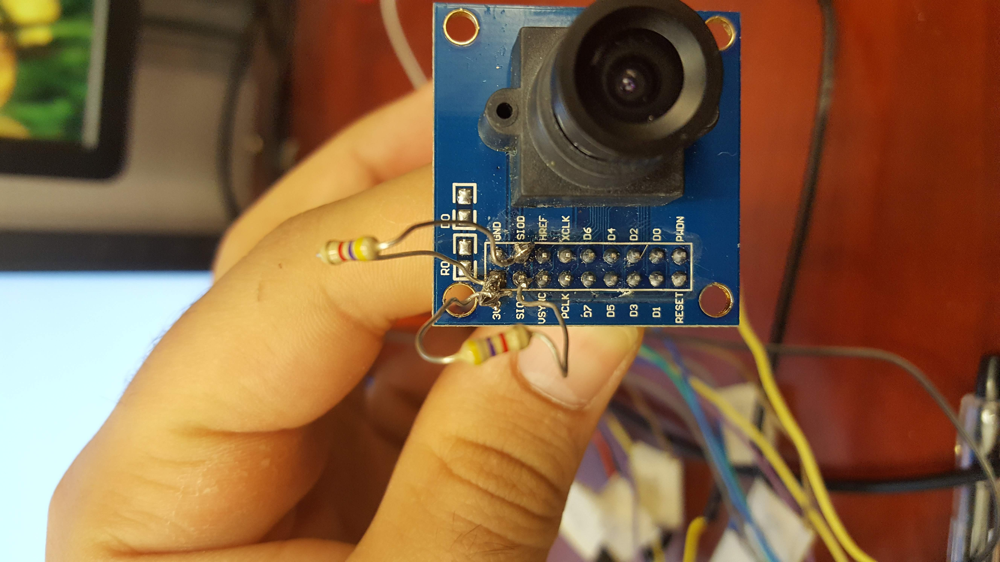

# OV7670_NEXYS4_Verilog

Introduction

The overall goal of this project was to use the analog camera, OV7670, with the FPGA, NEXYS4, in order to display the camera’s image onto a monitor. To do this, Verilog and Vivado were used to program the FPGA. To connect the camera to the FPGA, male to female headers were connected from the camera’s headers to the FGPA’s pmod connectors. To connect the FPGA to a monitor, a vga cable was connected from the FPGA to the monitor. Once all wired up and programmed, the FPGA should be able to read the image from the camera and display it on the monitor.

Connections

In order for the camera to communicate properly to the FPGA, the wires must be properly connected to the FPGA’s pmod connectors. Along with that, two 4.7k resistors will need to be soldered onto the camera. The first one needs to be connected from the SIOC to 3v3 and the other one needs to be soldered from SIOD to 3v3. These resistors are used as pull up resistors in the I2C like communication protocol. The table below shows how the rest of the camera needs to be wired.

        Camera Header   PMOD Port
        RESET	        JXADC6
        D1	        JA2
        D3	        JA3
        D5	        JA4
        GND	        JA5
        3v3	        JA6
        D7	        JA7
        HREF	        JA8
        VSYNC	        JA9
        SIOC	        JA10
        D2	        JB1
        D4	        JB2
        D6	        JB3
        XCLK	        JB4
        PWDN	        JB7
        D0	        JB8
        SIOD	        JB9
        PCLK	        JB10

Verilog Program

The Verilog program is broken down into 6 main parts. The first part is used to convert the 100MHz clock into 50MHz and 25MHz clocks. This is a simple module called clocking_verilog. The 2nd module, debounce, acts like a reset. The 3rd module, vga, is the module that takes the camera frame and actually displays it onto the monitor. The fourth module, frame_buffer, holds onto the image data until the whole image has been acquired. This synchronizes the cameras frame rate with the monitors frame rate. The frame buffer is an IP that must be downloaded and imported into your Verilog project. The 5th module, ov7670_capture_verilog, is the module that actually reads the data from the camera. The last module, ov7670_controller_verilog, is the module used to program the camera’s data registers. The module consists of two parts, i2c_sender_verilog and ov7670_registers_verilog. The first submodule, i2c_sender_verilog, is the module that actually handles the I2C like communication and sends the data to the camera. The second submodule, ov7670_registers_verilog, is the module that tells the i2c_sender what data needs to be written to the camera’s registers. All of this code combined allows the FPGA to program the camera, read frames from the camera, and then display the frames onto the monitor.

Conclusion

In order to use an FPGA to read from an analog camera and then display the camera frames on the monitor is a very hard and complicated process. This is due to the fact that the camera and the monitor may not be synchronized. Therefore a frame buffer must be used to hold onto the data until it is ready to be used. Lastly, the I2C like communication protocol was very complex and requires the user to program a lot of different registers in order to get the camera to output the data correctly. Now that the FPGA can read from the camera, many image process techniques can be applied to the image in a very fast and efficient manner. 
